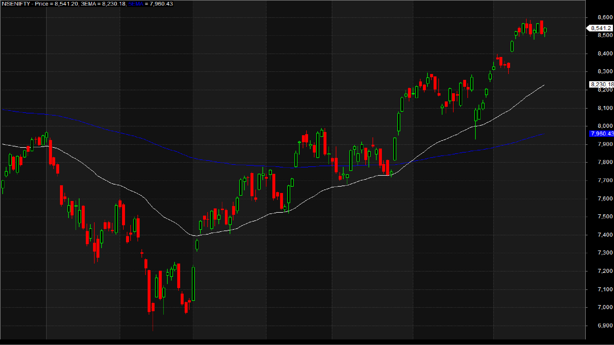

# Algorithmic Trading Bot

## What is Algorithmic Trading?
Algorithmic trading utilizes automated, pre-programmed instructions for executing trades, optimizing factors like price, time, and volume to outperform human traders. It facilitates diverse strategies such as statistical arbitrage, momentum, mean reversion, and machine learning-based approaches. By processing information rapidly and reducing human error, algorithmic trading enhances market efficiency but can also amplify market volatility. The success of these strategies hinges on data quality, algorithmic sophistication, and the speed of execution. 

AQR Quant Leads
- Bryan T. Kelly
- Markus Pelger

https://deliverypdf.ssrn.com/delivery.php?ID=792126078082084082065077072097005022052064034046037088095080094078115030027104076121021054120036117058055087126101114072103083047070090046036106067104000001122075017008033064069075108120116078008093086081110084022095106098100097065084073065000078065&EXT=pdf&INDEX=TRUE

- combine language/domain knowledge with data ml skills to create forex project based on global events nlp? 

- Need to read medium articles
- first need to backtrack and then eventually can implement real time trades

