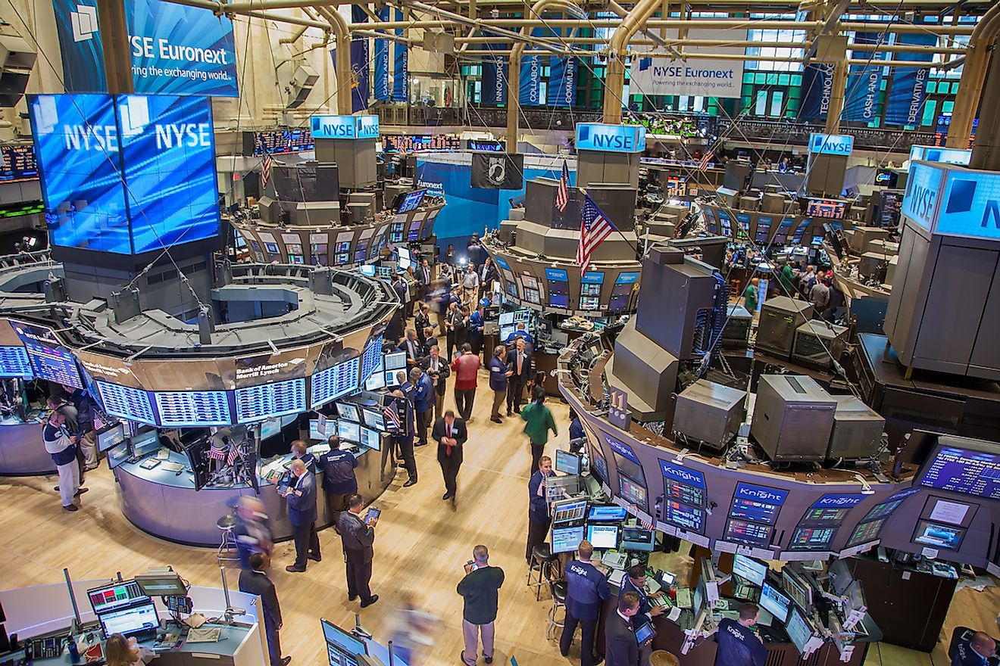

# Algorithmic Trading Bot

## What is Algorithmic Trading?
Algorithmic trading utilizes automated, pre-programmed instructions for executing trades, optimizing factors like price, time, and volume to outperform human traders. It facilitates diverse strategies such as statistical arbitrage, momentum, mean reversion, and machine learning-based approaches. By processing information rapidly and reducing human error, algorithmic trading enhances market efficiency but can also amplify market volatility. The success of these strategies hinges on data quality, algorithmic sophistication, and the speed of execution. 

## Types of Algorithmic Trading Strategies
1. **Statistical Arbitrage:** This strategy involves exploiting statistical mispricing of one or more assets based on the expected value of these assets. It typically involves complex mathematical models and can be applied to various asset classes.
2. **Market Making:** In this strategy, the algorithm aims to profit from the spread between the buy and sell prices by continuously placing buy and sell limit orders. The goal is to capture the spread between these orders without accumulating a large position in any individual asset.
3. **Momentum Trading:** This strategy involves buying securities that are trending upward and selling those that are trending downward. Algorithms identify trends using various technical indicators and statistical measures.
4. **Mean Reversion:** This strategy is based on the assumption that prices and returns eventually move back towards the mean or average. Algorithms identify and exploit deviations from historical average prices or returns.
5. **Machine Learning-Based Strategies:** These involve using machine learning techniques to predict market movements. They can range from simple linear regression models to complex neural networks and decision trees.
6. **High-Frequency Trading (HFT):** This involves making a large number of trades at very high speeds. HFT strategies rely on advanced algorithms and ultra-fast data networks, and they often exploit very small price discrepancies in the market.
7. **Sentiment Analysis:** Algorithms analyze news articles, social media feeds, and other textual data to gauge market sentiment and predict market movements based on this sentiment.
8. **Pairs Trading:** This strategy involves taking simultaneous long and short positions in two highly correlated assets. The idea is to profit from any divergence in their price relationship.
9. **Index Fund Rebalancing:** This strategy takes advantage of predictable trades made by index funds as they rebalance their portfolios. Algorithms can anticipate these trades and position themselves accordingly.
10. **Quantitative Strategies:** These involve strategies that are purely based on quantitative analysis. They use mathematical computations and number crunching to identify trading opportunities.

## Choosing a Trading Strategy
Factors to consider when choosing a trading strategy. 
1. **Risk Tolerance:** Determine your comfort level with risk. Different strategies come with varying levels of risk and potential reward. Understanding your risk tolerance is crucial in choosing a strategy that won't lead to undue stress or financial strain.
2. **Investment Goals:** Clearly define what you aim to achieve. Whether it's short-term gains, long-term wealth accumulation, or steady income, your goals will significantly influence the most appropriate trading strategy.
3. **Capital Availability:** Consider how much money you are willing to invest. Some strategies require a substantial initial investment, while others can be executed with limited capital.
4. **Time Commitment:** Evaluate how much time you can dedicate to your trading activities. Active trading strategies like day trading require considerable time and attention, whereas passive strategies need less frequent monitoring.
5. **Market Knowledge:** Assess your understanding of the markets and the specific assets you're interested in. A strategy that aligns with your level of expertise can help in making more informed decisions and reduce the likelihood of significant losses.

## Types of Securities Traded
1. **Equities (Stocks):** One of the most common assets for algorithmic trading. Algorithms can execute trades based on market conditions, company news, or technical indicators.
2. **Options and Futures:** Derivatives like options and futures are popular among algorithmic traders due to their leverage and the complexity of trading strategies they allow, such as hedging and speculation.
3. **Foreign Exchange (Forex):** The forex market is particularly suited to algorithmic trading due to its high liquidity, large trading volume, and 24/5 operating hours. Algorithms can exploit small price movements in currency pairs.
4. **Fixed-Income Securities:** Bonds and other fixed-income products are traded algorithmically, often focusing on arbitrage opportunities and relative value trades.
5. **Commodities:** This includes physical commodities like oil, gold, and agricultural products. Algorithmic strategies in commodities often focus on trend following and macroeconomic indicators.
6. **Cryptocurrencies:** The crypto market, with its high volatility and 24/7 operation, presents unique opportunities for algorithmic traders, though it also carries higher risks.
7. **Exchange-Traded Funds (ETFs):** ETFs, which track indices, commodities, or baskets of assets, are also a popular choice for algorithmic trading, especially for strategies like statistical arbitrage.
8. **Index and Mutual Funds:** While typically associated with passive management, these funds can also be the subject of algorithmic trades, particularly for strategies based on market timing and index fund rebalancing.

## Resources and Notes
**AQR Quant Leads**
- Bryan T. Kelly
- Markus Pelger
- was recommended by someone at AQR that if you want to impress a firm you can implement a strategy of one of their Quant Researchers

https://deliverypdf.ssrn.com/delivery.php?ID=792126078082084082065077072097005022052064034046037088095080094078115030027104076121021054120036117058055087126101114072103083047070090046036106067104000001122075017008033064069075108120116078008093086081110084022095106098100097065084073065000078065&EXT=pdf&INDEX=TRUE

**Medium articles and resources**

**Other ideas**
- combine language/domain knowledge with data ml skills to create forex project based on global events nlp? 

**Notes**
- first backtrack and then we can implement the strategy live with paper trading

